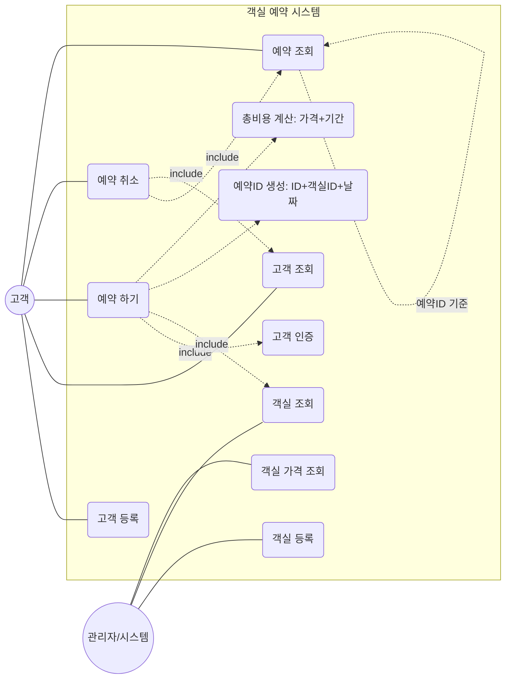

```mermaid
graph LR
    %% 액터 설정
    Customer((고객))
    Admin((관리자/시스템))

    subgraph "객실 예약 시스템"
        %% 고객 관련 유스케이스
        UC_RegCust(고객 등록)
        UC_ViewCust(고객 조회)
        UC_Auth(고객 인증)

        %% 객실 관련 유스케이스
        UC_RegRoom(객실 등록)
        UC_ViewRoom(객실 조회)
        UC_ViewPrice(객실 가격 조회)

        %% 예약 관련 유스케이스
        UC_Reserve(예약 하기)
        UC_Cancel(예약 취소)
        UC_ViewRes(예약 조회)

        %% 계산 및 생성 로직 (상세 기능)
        Logic_ID(예약ID 생성: ID+객실ID+날짜)
        Logic_Price(총비용 계산: 가격+기간)
    end

    %% 액터와 유스케이스 연결
    Customer --- UC_RegCust
    Customer --- UC_ViewCust
    Customer --- UC_Reserve
    Customer --- UC_Cancel
    Customer --- UC_ViewRes

    Admin --- UC_RegRoom
    Admin --- UC_ViewRoom
    Admin --- UC_ViewPrice

    %% 포함(Include) 관계 및 제약 조건
    UC_Reserve -.->|include| UC_Auth
    UC_Reserve -.->|include| UC_ViewRoom
    UC_Reserve -.-> Logic_ID
    UC_Reserve -.-> Logic_Price

    UC_Cancel -.->|include| UC_ViewRes
    UC_Cancel -.->|include| UC_ViewCust

    %% 조회 관계
    UC_ViewRes -.->|예약ID 기준| UC_ViewRes
```
