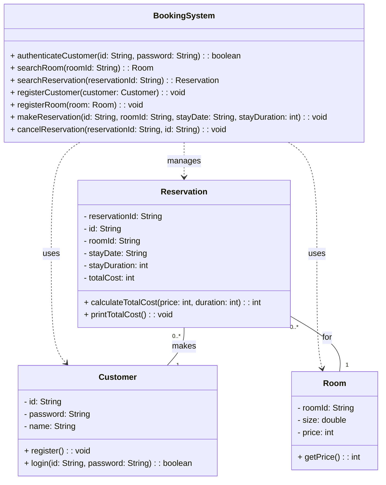

```mermaid
classDiagram
    class Customer {
        - id: String
        - password: String
        - name: String
        + register(): void
        + login(id: String, password: String): boolean
    }

    class Room {
        - roomId: String
        - size: double
        - price: int
        + getPrice(): int
    }

    class Reservation {
        - reservationId: String
        - id: String
        - roomId: String
        - stayDate: String
        - stayDuration: int
        - totalCost: int
        + calculateTotalCost(price: int, duration: int): int
        + printTotalCost(): void
    }

    class BookingSystem {
        + authenticateCustomer(id: String, password: String): boolean
        + searchRoom(roomId: String): Room
        + searchReservation(reservationId: String): Reservation
        + registerCustomer(customer: Customer): void
        + registerRoom(room: Room): void
        + makeReservation(id: String, roomId: String, stayDate: String, stayDuration: int): void
        + cancelReservation(reservationId: String, id: String): void
    }

    BookingSystem ..> Customer : uses
    BookingSystem ..> Room : uses
    BookingSystem ..> Reservation : manages
    Reservation "0..*" -- "1" Customer : makes
    Reservation "0..*" -- "1" Room : for
```
